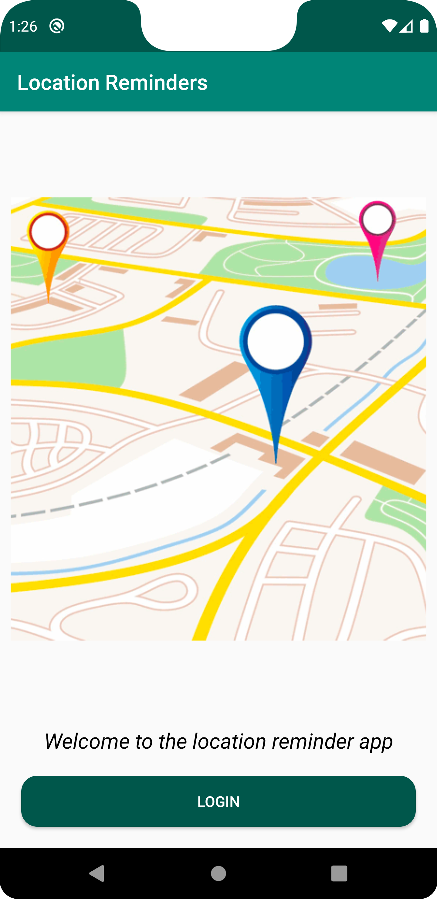
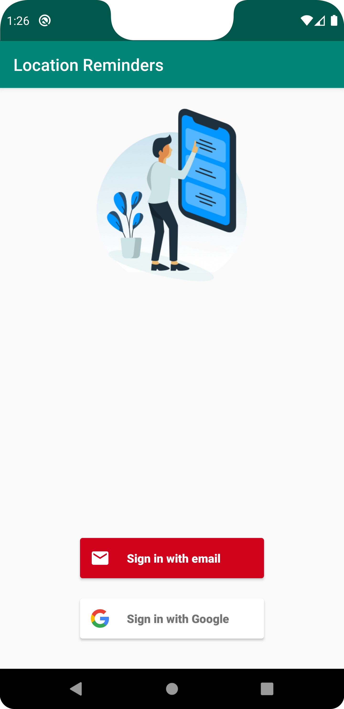
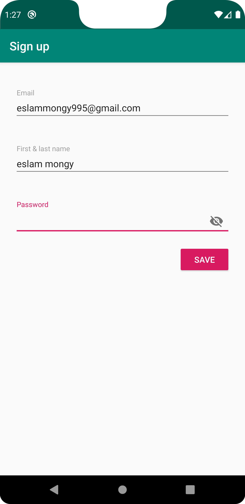
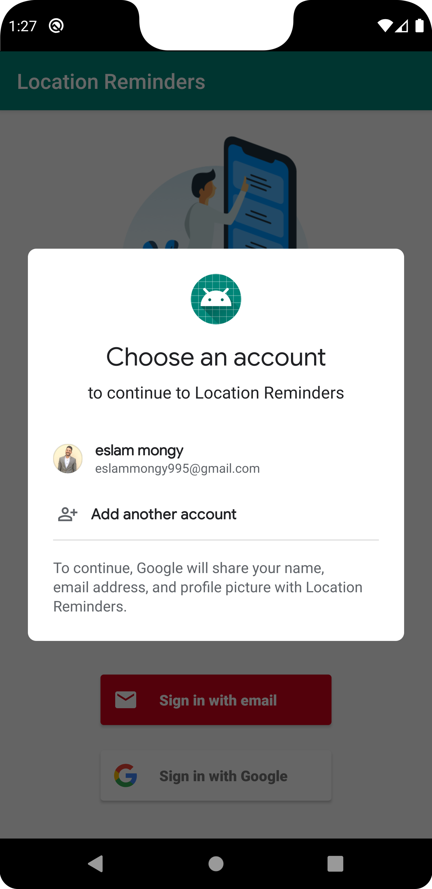
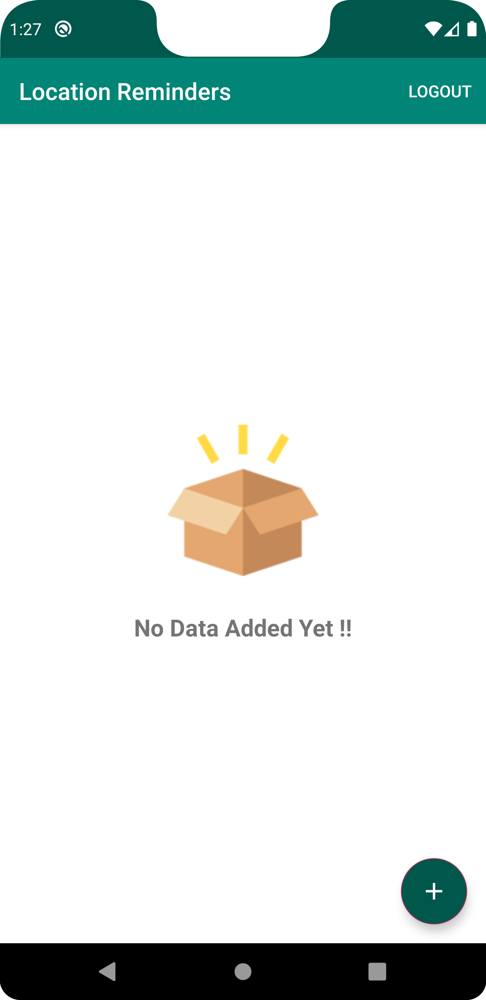
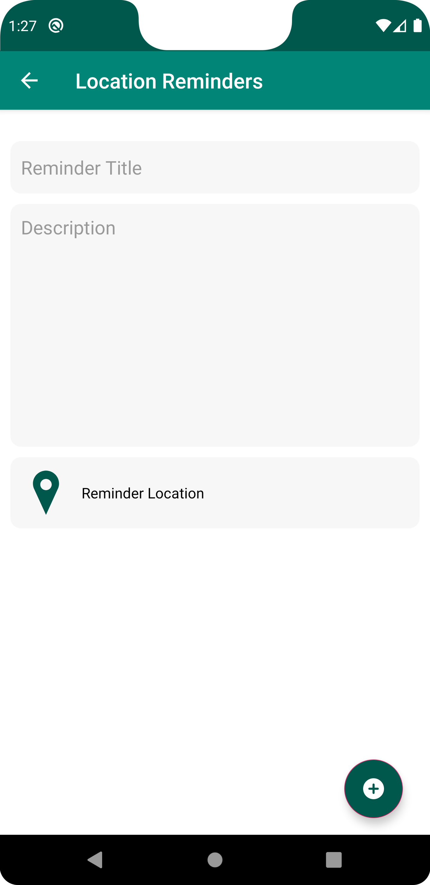
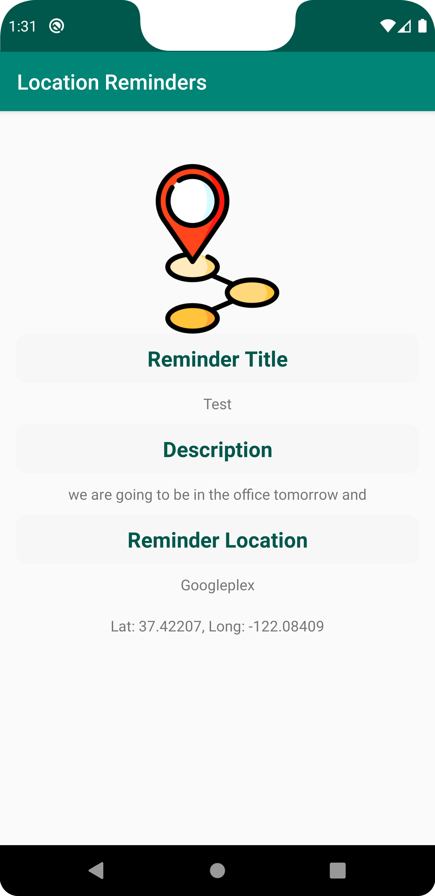
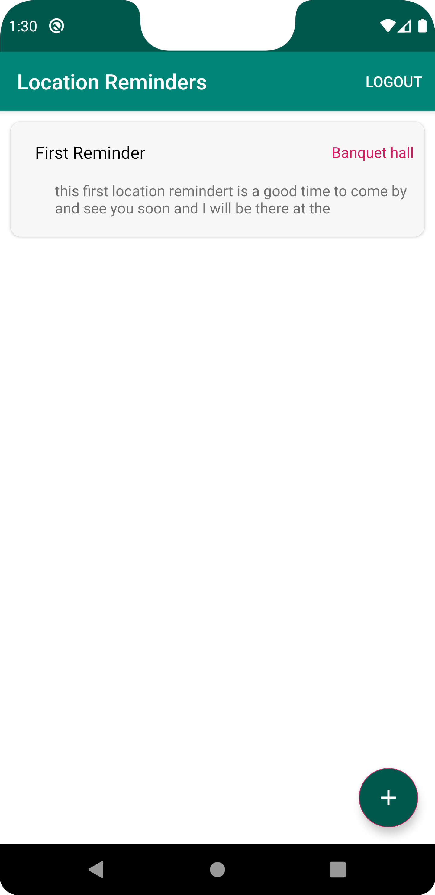

# Android NanoDegree Location Reminders

This project is part of the [Andrlid Kotlin Developer Nanodegree] from Udacity.

### Steps to Setup google-services.json
1. Go to https://console.firebase.google.com/
2. Setup Firebase project 
3. Register app with Firebase
4. Add sign-in provider (email and google) for authentication
5. Download `google-services.json` to `app` folder directory

You need to setup your own `Google MAP API Key` and update the [google_maps.api.xml]

### Steps to Setup Google MAP API Key
1. Go to https://console.cloud.google.com/
2. Select the Firebase project that you created previously
3. Enable Maps SDK in API & Services
4. Setup API usage restriction to your app only (optional)
5. In API & Services, credentials, create credentials to get the API KEY
6. Update your API Key in [google_maps.api.xml]

